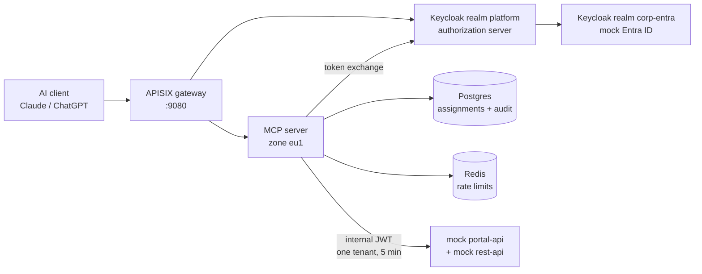
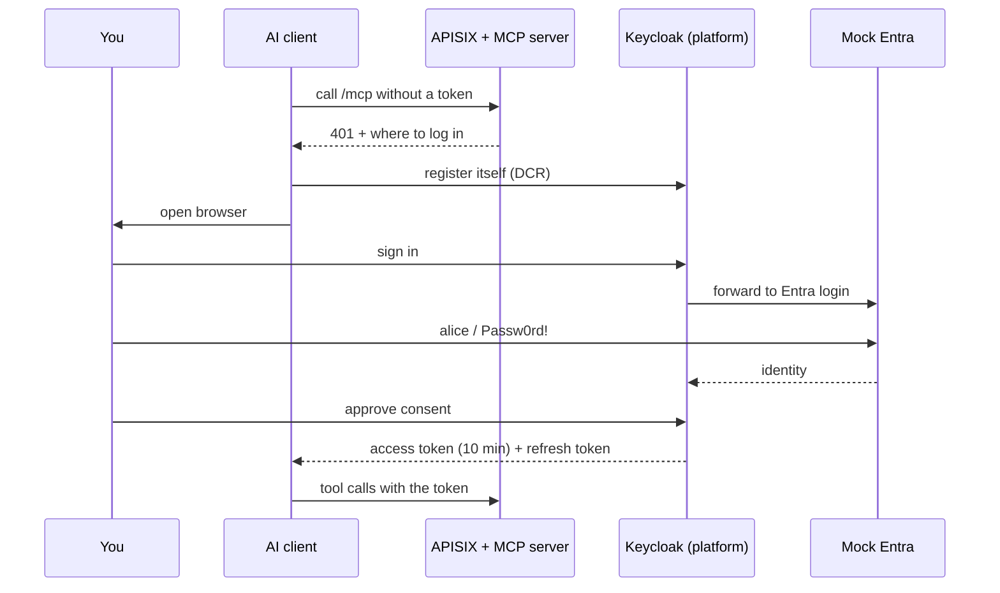
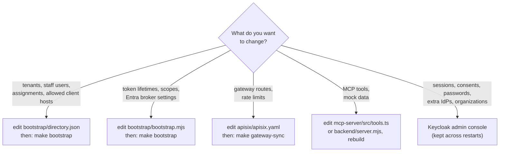
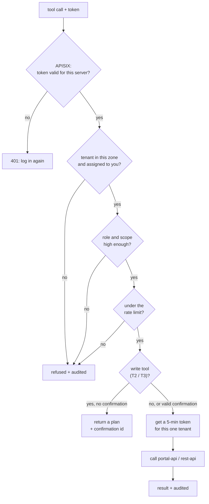

# mcp-keycloak-apisix

A working, all-in-containers lab of an **OAuth-protected, multi-tenant MCP server**.
It runs an MCP server that Claude Desktop, Claude Code, claude.ai and ChatGPT can
connect to. Before using any tool you **sign in** through a standard OAuth login;
after that, every tool call is checked against which tenants you're assigned to,
with which role, and written to an audit log.

Everything behind the MCP server (portal-api, rest-api, Entra ID) is mocked, so the lab runs
on a laptop with nothing but Docker.

- [Architecture](#architecture)
  - [What each piece does, and why it's there](#what-each-piece-does-and-why-its-there)
- [Set it up](#set-it-up)
- [Connect a client](#connect-a-client)
- [Things to try](#things-to-try)
- [Consoles and dashboards](#consoles-and-dashboards)
- [How to change things](#how-to-change-things)
- [How it works](#how-it-works)
- [Troubleshooting](#troubleshooting)
- [Lab simplifications](#lab-simplifications)

---

## Architecture



The AI client only ever talks to the gateway. The gateway fronts two things: the
Keycloak login pages and the MCP server. Everything else is on the internal Docker
network.

| Part | What it does | Where it lives |
| --- | --- | --- |
| **APISIX** | The only public entrance. Checks tokens early, rate-limits, strips smuggled identity headers | `apisix/apisix.yaml` (routes), `apisix/config.yaml` |
| **Keycloak `platform` realm** | The OAuth server: login, consent, tokens, self-registration of AI clients, token exchange | configured by `bootstrap/bootstrap.mjs` |
| **Keycloak `corp-entra` realm** | Stands in for the company's Entra ID. Holds the demo users and passwords | `bootstrap/directory.json` |
| **MCP server** | The decision point: which person, which tool, which tenant, which role | `mcp-server/src/` (TypeScript) |
| **Postgres** | Tenants, assignments (who may work where), audit log. Also Keycloak's database | `db/init/01-schema.sql` |
| **Redis** | Rate-limit counters per person, tenant and risk tier | — |
| **Mock portal-api / rest-api** | Fake contact-center platform APIs. Accept only the one-tenant token the MCP server gets from Keycloak | `backend/server.mjs`, `openapi/` |
| **etcd** | Stores the gateway config so the APISIX dashboard can show it | loaded from `apisix/apisix.yaml` |

### What each piece does, and why it's there

Think of the platform as an office building where each customer (tenant) has its own
rooms. Each piece of the lab answers **exactly one question**, and none of them trusts
another to answer its question for it. That's the test for whether a piece belongs:
take it away, and something specific breaks or becomes unsafe.

| Piece | The one question it answers | In the building |
| --- | --- | --- |
| AI client | "What does the person want done?" | the visitor asking for something |
| APISIX gateway | "Is this request well-formed and not an attack?" | the front door with the security scanner |
| Keycloak (`platform` realm) | "Who is this person, and did they agree to let this AI act for them?" | reception, which checks ID and hands out visitor badges |
| Mock Entra ID (`corp-entra`) | "Is this really one of our employees?" | the HR system reception phones to confirm |
| MCP server | "May this person do this action, in this tenant, right now?" | the floor manager who checks the badge against the room list |
| Assignment store (Postgres) | "Which tenants may this person work in, with which role, until when?" | the room-access list |
| Token exchange + internal token | "Which one room is this key cut for?" | a key that opens one room for five minutes |
| Backend middleware | "Is this key genuine, and for which room?" | the lock on each room door |
| Mock portal-api / rest-api | "Do the actual work." | the room itself |
| Audit log | "Who did what, where, and when?" | the CCTV recording |

#### AI client (Claude Desktop, Claude Code, claude.ai, ChatGPT)

- **Job:** turns what you ask into tool calls, and handles login and token refresh for you.
- **Why it's there:** it's the product experience. People work in the AI tool they already use.
- **Not trusted.** It isn't ours, it can be tricked by prompt injection, and the safety hints
  it gets (read-only, destructive) are advisory. Every piece behind it assumes it could
  send anything.

#### APISIX gateway (`apisix/apisix.yaml`)

- **Job:** the single public entrance on port 9080. It routes login traffic to Keycloak
  and MCP traffic to the MCP server. Before a request goes further, it checks the token's
  signature, issuer and audience, rate-limits per IP, caps request sizes, strips identity
  headers a client might try to smuggle in (like `X-Tenant-ID`), and tags each request with
  an id.
- **Why it's there:** it stops junk and floods before they cost backend capacity, and it's
  one place to apply the same protections to every API. It also hides everything that
  shouldn't be public: the Keycloak admin console and master realm return 404 here.
- **Without it:** every service would need its own edge protection, and a scan or flood
  would hit the MCP server and Keycloak directly.
- **Doesn't:** decide what a person may do. It can't see the tool or tenant well enough to
  make that call, so it only filters. It never turns a token into trusted headers either;
  the services behind it check the token themselves.

#### Keycloak, realm `platform` (the authorization server)

- **Job:** the OAuth 2.1 server the AI clients talk to. It lets AI apps register themselves
  (Dynamic Client Registration), runs the login and the consent screen, and issues a
  short-lived access token (10 min) that only works for this MCP server. It refreshes that
  token quietly. It also performs **token exchange**: it swaps a person's token for a
  5-minute internal token pinned to one tenant.
- **Why it's there:** MCP clients only connect through the standard MCP OAuth flow
  (discovery, PKCE, audience-bound tokens). Something has to speak it, and it keeps
  identities in one place, whatever login system is upstream.
- **Without it:** people would paste long-lived API keys into AI tools. Those keys would be
  unscoped, never expire, and couldn't be traced to a person.
- **Doesn't:** decide which tenants someone may touch. It knows *who* you are, not *where*
  you may go.

#### Keycloak, realm `corp-entra` (mock Entra ID)

- **Job:** stands in for the company's Microsoft Entra ID. Staff sign in here. Realm
  `platform` doesn't hold passwords for them: it forwards the login here ("brokering") and
  trusts the answer.
- **Why it's there:** staff already have one company login, and disabling someone there
  should cut their access everywhere. With a real setup, you'd point the `entra` identity
  provider at your actual Entra tenant.
- **Doesn't:** talk to the AI clients. They only ever see realm `platform`, one issuer, no
  matter how many upstream logins exist.

#### MCP server (`mcp-server/src/`)

- **Job:** the decision point. It checks the token again (it must be meant for this server),
  then, for every call: which tenant (from the explicit `tenant_id` argument), whether that
  tenant belongs to this server's zone, whether the person has an active assignment there,
  whether their role and scope are high enough, and whether they're under the rate limit.
  For risky tools it returns a plan and asks for confirmation first. Then it gets a
  one-tenant token and calls the backend. It writes an audit record for every call.
- **Why it's there:** it's the only place that knows the person, the tool and the tenant at
  the same time. It also turns many uneven backend routes into a small set of clear,
  task-level tools, each with a risk tier.
- **Without it:** the AI client would call the backends directly, where nothing checks
  tenant assignments or asks for confirmation.
- **Doesn't:** store business data or log people in. It's stateless: any number of copies can
  run side by side, since all state is in Postgres and Redis.

#### Assignment store (Postgres, `db/init/01-schema.sql`)

- **Job:** the explicit list of who may work in which tenant, with which role, until when,
  and why. It also holds the tenants and the zone each lives in, the audit log, and the
  confirmation ids that have been used.
- **Why it's there:** "may this person work in tenant T?" must be a reviewable fact, not
  something implied by being logged in. Every change to it is logged too
  (`assignment_changes`).
- **Without it:** anyone with a login would effectively reach every tenant.
- **Doesn't:** check passwords or tokens. The same Postgres also holds Keycloak's own
  database, separately.

#### Redis

- **Job:** counts calls per (person, tenant, risk tier) per minute, plus a daily cap for the
  riskiest tools.
- **Why it's there:** it keeps the counts correct when several MCP server copies run at once.
  In-memory counters would each only see part of the traffic.

#### Token exchange and the internal token

- **Job:** before calling a backend, the MCP server asks Keycloak to swap the person's access
  token for an internal one. That token names exactly one tenant and role, says that the MCP
  server acted on the person's behalf (`act`), is meant only for the backends
  (`aud = platform-backend`), and expires in 5 minutes.
- **Why it's there:** the person's own token never goes further than the MCP server, and the
  backends never have to trust the MCP server's word about which tenant is meant. The
  tenant is inside a token Keycloak signed.

#### Backend middleware + mock portal-api / rest-api (`backend/server.mjs`)

- **Job:** the mocks stand in for the real platform APIs (campaigns, segments, customers,
  SMS, …) with fake data. What's *not* mock is their auth middleware. It accepts only the
  internal token, checks its signature, issuer, audience and `act` claim, and takes the
  tenant from the token, never from the URL or a header.
- **Why it's there:** defence in depth. Even if something upstream were wrong or bypassed, the
  backend still refuses any request without a valid key for that exact tenant.
- **Doesn't:** replace the backend's own permission checks. It adds a tenant lock in front of them.

#### Audit log (`audit_log` table + a JSON line per call on stdout)

- **Job:** one record per tool call, reads included. It records who (person and AI app),
  which tenant, which tool and risk tier, a hash of the arguments plus a redacted copy, the
  confirmation id, the outcome (allowed, planned, refused and why, error), which backend
  route was called, and how long it took.
- **Why it's there:** when staff can act across tenants, this record is the evidence that
  access was legitimate, and the first place to look in an incident.
- **Doesn't:** store tokens, full personal data or prompt text.

#### Supporting pieces

| Piece | Role |
| --- | --- |
| **etcd** | Stores the gateway config so the APISIX dashboard can list and edit it |
| **gateway-seed** job (`apisix/seed/`) | Loads `apisix/apisix.yaml` into the gateway and removes anything not in the file, so the file stays the source of truth |
| **bootstrap** job (`bootstrap/`) | Configures both Keycloak realms (clients, scopes, token lifetimes, registration rules, the Entra broker) and syncs `directory.json` into the assignment store. Safe to re-run |
| **api-docs** (Swagger UI) | Read-only docs for the mock APIs on port 8082 |
| **cloudflared** | Only with `make tunnel`: gives the gateway a public HTTPS URL so cloud-hosted clients (claude.ai, ChatGPT) can reach it |

#### Why several pieces check the same token

The gateway, the MCP server and the backends all verify tokens, and none of it is
redundant. The gateway checks cheaply to reject junk early. The MCP server checks
because it makes the decision. The backends check because they hold the data. Each
check guards against a different failure.

---

## Set it up

**You need:** Docker Desktop (or Docker Engine with Compose v2), and Node.js 20+ if you
want to run the tests or connect Claude Desktop.

```bash
git clone https://github.com/jricardooliveira/mcp-keycloak-apisix.git
cd mcp-keycloak-apisix
make up                                      # first start takes 1–2 minutes
make test                                    # optional: full login + tool calls in a script
```

When `make up` finishes it prints the URLs. Everything listens on `127.0.0.1` only.

| What | URL | Login |
| --- | --- | --- |
| **MCP server** (give this to your AI client) | `http://localhost:9080/mcp` | you sign in on first use |
| Keycloak admin console | http://localhost:8081 | `admin` / `admin` |
| APISIX dashboard | http://localhost:9180/ui | gear icon → admin key `local-apisix-admin-key` |
| Mock API docs (Swagger UI) | http://localhost:8082 | — |

**Demo users** (you'll type these on the "Corporate Entra ID" login page):

| User | Password | Can do |
| --- | --- | --- |
| `alice` | `Passw0rd!` | Supervisor in **1001 Acme Retail**, support operator in **1002 Globex Telecom**. Also assigned to 2001 Initech Bank, but that tenant lives in another zone |
| `bob` | `Passw0rd!` | Viewer in 1001. His 1002 assignment has **expired** |
| `carol` | `Passw0rd!` | Can sign in, but has no tenants |

Other commands:

```bash
make down          # stop, keep data
make reset         # stop and delete all data (fresh start on next make up)
make logs          # follow the MCP server and gateway logs
make audit         # last 30 tool calls: who, tenant, tool, allowed/denied and why
make assignments   # who may work in which tenant
```

---

## Connect a client

The first time a client connects, it opens a browser. Keycloak sends you to the mock
Entra login, you sign in, approve the consent screen, and you're connected. The
client refreshes its token quietly after that.



### Claude Desktop (local, recommended)

Claude Desktop runs a small bridge (`mcp-remote`) on your machine, so nothing needs
to be public.

1. **Quit Claude Desktop** (Cmd+Q). It rewrites its config file while running.
2. Add the server to `~/Library/Application Support/Claude/claude_desktop_config.json`,
   keeping what's already there:

   ```bash
   f=~/Library/Application\ Support/Claude/claude_desktop_config.json
   cp "$f" "$f.bak"
   jq --arg npx "$(command -v npx)" '.mcpServers.platform = {
         "command": $npx,
         "args": ["-y", "mcp-remote", "http://localhost:9080/mcp", "--allow-http"]
       }' "$f.bak" > "$f"
   ```

   The full path to `npx` matters: Claude Desktop doesn't load your shell's `PATH`.
3. Open Claude Desktop. A browser tab opens: sign in as `alice`, click **Yes**.
4. In a new chat, check the tools menu for **platform**, and ask *"What Platform tenants can I work in?"*

### Claude Code

```bash
make claude        # = claude mcp add --transport http platform http://localhost:9080/mcp
```

Then in Claude Code run `/mcp`, pick **platform**, choose **Authenticate**.

### claude.ai, ChatGPT, or a Claude Desktop custom connector

These connect from the vendor's cloud, so they need a public HTTPS URL. The lab uses
a free Cloudflare quick tunnel (no account needed):

```bash
make tunnel        # prints https://<random>.trycloudflare.com/mcp
```

Add the printed URL as a custom connector (claude.ai / Claude Desktop: **Settings →
Connectors → Add custom connector**; ChatGPT: **Settings → Apps & Connectors →
Advanced → Developer mode → Create**). Leave client id and secret empty.

- The tunnel URL is **random and changes every time**. `make tunnel` re-points Keycloak,
  the gateway and the MCP server at it, which signs everyone out.
- **The login page is public while the tunnel runs.** Change the demo passwords first
  (see [Change a password](#change-a-password-or-disable-a-user)).
- `make local` stops the tunnel and goes back to `http://localhost:9080`.

---

## Things to try

Signed in as `alice`:

| Ask | What you'll see |
| --- | --- |
| *"What Platform tenants can I work in?"* | Your assignments, roles and zones |
| *"How are Acme's queues right now?"* | Live stats (mock) |
| *"Compare the conversion rates of Acme's campaigns."* | Campaign stats |
| *"Find customer Maria Santos in Acme."* | Personal data: Claude must give a reason, which is audited |
| *"Create a segment in Acme called High spenders with rule lifetime_value > 8000."* | A **plan** first; it only runs after you confirm |
| *"Pause the Loyalty NPS survey campaign at Acme."* | Plan, then an explicit yes |
| *"Send an SMS to +351910000002 from Acme saying the order shipped."* | Plan with a cost estimate |
| *"Start the 5G upgrade campaign at Globex."* | **Refused**: support operator is below supervisor |
| *"List campaigns for Initech Bank."* | **Refused**: that tenant is served by zone eu2 |

Then run `make audit` to see every call, including the refused ones.

To try another user: quit Claude Desktop, run `rm -rf ~/.mcp-auth`, reopen, sign in as `bob`.

---

## Consoles and dashboards

### Keycloak admin console — http://localhost:8081

Sign in with `admin` / `admin`. Use **Manage realms** (top left) to switch to `platform`.

| In realm `platform` | What you'll find |
| --- | --- |
| **Clients** | `platform-mcp-server` (does token exchange), `platform-backend` (audience for portal-api/rest-api), and one client per AI app that registered itself, e.g. *MCP CLI Proxy* = Claude Desktop |
| **Client scopes** | `platform:read`, `platform:write` (what you consent to), `tenant-<id>` and `role-<role>` (used to build the one-tenant token), `backend-audience` |
| **Users**, **Sessions** | alice, bob, carol; who is signed in, with which client |
| **Identity providers** | `entra`, the broker to the mock Entra ID |
| **Organizations** | *Example Corp*, linked to `entra` |
| **Events** | logins, token exchanges, app registrations and failed registrations |
| **Clients → Client registration** | the rules for AI apps registering themselves |

Realm `corp-entra` is the mock Entra ID; the demo users' passwords live there.

### APISIX dashboard — http://localhost:9180/ui

Click the gear icon, enter `local-apisix-admin-key`. **Routes** lists the 8 gateway
routes with a description each; **View** shows a route's plugins (token check, rate
limit, …). **Upstreams** shows the MCP server and Keycloak.

### Mock API docs — http://localhost:8082

Swagger UI for the mocked **rest-api** and **portal-api** APIs: every route, which MCP tool
calls it, and what the internal token must contain. Read-only: the mocks are only
reachable from inside Docker, and only with the token the MCP server gets per call.

---

## How to change things

Most configuration is **code in this repo**, applied by a command. Some things can
also be changed in a console. Use this to decide where:



**Why this matters:** `make bootstrap` also runs on every `make up` and `make tunnel`.
It resets whatever it manages to what the files say. The table shows what it
overwrites; everything else you change in the Keycloak console is kept.

| `make bootstrap` resets | Kept (safe to change in the console) |
| --- | --- |
| realm `platform` token and session lifetimes, event settings | sessions, consents, events already recorded |
| client scopes `platform:read`, `platform:write`, `tenant-*`, `role-*`, `backend-audience` (incl. their mappers) | any other client scope you create |
| clients `platform-mcp-server`, `platform-backend`, `platform-keycloak-broker` | clients that AI apps registered, clients you create |
| identity provider `entra`, and the automatic redirect to it on the login page | any other identity provider |
| the anonymous client-registration policies | other client policies |
| name and email of users listed in `directory.json`; their assignments | passwords and enabled/disabled (set only when a user is first created), users not in the file |

### Add a tenant

1. Add it to `tenants` in `bootstrap/directory.json`:

   ```json
   { "tenant_id": 1003, "name": "Umbrella Health", "zone": "eu1" }
   ```

   The zone must be `eu1` for this MCP server to serve it. Any other zone gets the
   "served by zone …" refusal.
2. Run `make bootstrap`. This adds the tenant to the store and creates the
   `tenant-1003` scope that the one-tenant token needs.
3. Assign someone to it (next section).

The mock backends start a new tenant with empty data. To give it campaigns,
customers and so on, add an entry to the `data` object in `backend/server.mjs`, then
run `docker compose up -d --build rest-api portal-api`.

Tenants are never deleted by the sync, because the audit log refers to them.

### Grant, change or revoke an assignment

Edit the person's `assignments` in `bootstrap/directory.json`, then `make bootstrap`.

```json
{
  "username": "bob", "firstName": "Bob", "lastName": "Barros", "groups": ["customer-success"],
  "assignments": [
    { "tenant_id": 1001, "role": "supervisor", "expires_at": "2026-12-31", "reason": "Covering for alice" }
  ]
}
```

- **Roles**, lowest to highest: `viewer`, `support_operator`, `supervisor`, `admin`.
  Reads need viewer, personal data and simple writes need support_operator, and
  destructive or costly actions need supervisor.
- **`expires_at`**: a date, or `null` for no expiry. After it passes, calls are refused.
- For a listed person, the file is complete: an assignment you remove from the file
  is removed from the store. `"assignments": []` revokes everything.
- Changes reach the MCP server **within 60 seconds** (its decision cache). No new login needed.
- Every change is logged in the `assignment_changes` table.

For a quick one-off test you can also use SQL. The next `make bootstrap` puts the
file's version back:

```bash
docker compose exec postgres psql -U platform -d platform -c \
  "UPDATE assignments SET role='supervisor' WHERE tenant_id=1001
   AND subject=(SELECT subject FROM principals WHERE username='bob');"
```

### Add a staff user

1. Add them to `staff` in `bootstrap/directory.json`:

   ```json
   {
     "username": "dave", "firstName": "Dave", "lastName": "Duarte", "groups": ["customer-success"],
     "assignments": [ { "tenant_id": 1001, "role": "viewer", "expires_at": null, "reason": "New in customer success" } ]
   }
   ```

   Optional fields: `"email"` (default `<username>@example.com`) and `"password"`
   (default `DEMO_PASSWORD`, i.e. `Passw0rd!`).
2. Run `make bootstrap`. This creates dave in the mock Entra, creates his linked Platform
   account, and adds his assignments.
3. dave can sign in right away.

Removing someone from the file does **not** delete them or their assignments (the
sync only manages people it lists). To cut access, set `"assignments": []` first and
run `make bootstrap`, or disable them as described next.

### Change a password or disable a user

**Password:** Keycloak admin console → realm **corp-entra** → **Users** → the user →
**Credentials** → **Reset password** (turn *Temporary* off). This is kept across
restarts. To change the default for new users, set `DEMO_PASSWORD=...` in `.env`
before they're first created, or run `make reset` to recreate everyone.

**Disable someone** (offboarding): turn **Enabled** off for the user in **both** realms.

- Realm **corp-entra** (like disabling them in Entra): stops new logins.
- Realm **platform**: stops their existing connection too. Their AI client's next token
  refresh fails with *User disabled*, so access ends within 10 minutes (the access
  token lifetime).

Disabling in corp-entra alone doesn't end a session that already exists: Keycloak
doesn't recheck the upstream login when a client refreshes its token. Both settings
survive `make bootstrap`.

### See who is connected, sign someone out, or revoke an app

- **Who is connected:** realm `platform` → **Sessions**, or **Users** → user → **Sessions**.
- **Cut one app's access for one person:** **Users** → user → **Consents** → **Revoke** on
  the app. This is the reliable way: AI clients ask for `offline_access`, so their
  refresh tokens are *offline* tokens, which signing out a normal session doesn't end.
  Revoking the consent does. The app will ask the person to sign in again.
- **Cut everything for one person:** disable them in realm `platform`
  ([above](#change-a-password-or-disable-a-user)).
- **Remove a registered app completely:** **Clients** → the app (e.g. *MCP CLI Proxy*) →
  **Action → Delete**. The app will register itself again on its next connection.
  For Claude Desktop, also delete `~/.mcp-auth` so the bridge doesn't reuse the old
  registration.

### Allow a new AI client to register

AI apps register themselves (Dynamic Client Registration). Keycloak only accepts a
registration when every URL in it (the login callback and the app's own homepage)
is on a host in `dcrTrustedHosts`:

```json
"dcrTrustedHosts": ["localhost", "127.0.0.1", "claude.ai", "claude.com", "anthropic.com",
                    "chatgpt.com", "openai.com", "platform.openai.com", "github.com"]
```

If a client fails with *"Policy 'Trusted Hosts' rejected request"*, find the host in
its error (or in realm `platform` → **Events**), add it here, and run `make bootstrap`. You
can look at the policy under realm `platform` → **Clients** → **Client registration**;
edit it in the file, not there.

### Change token lifetimes or consent texts

These are in `bootstrap/bootstrap.mjs`, function `configurePlatform`:

| Setting | Where | Default |
| --- | --- | --- |
| Access token lifetime | `accessTokenLifespan` | 600 s |
| Idle time before the login expires | `ssoSessionIdleTimeout` | 48 h |
| Refresh token rotation | `revokeRefreshToken` | on (each refresh token works once) |
| Internal (one-tenant) token lifetime | `"access.token.lifespan"` on `platform-mcp-server` | 300 s |
| Consent screen text | `consent("…")` on `platform:read` / `platform:write` | — |

Run `make bootstrap` after editing.

### Add another identity provider (e.g. a customer's own login)

Use this when a tenant brings its own identity provider.

1. Realm `platform` → **Identity providers** → **Add provider → OpenID Connect**. Enter the
   provider's discovery URL, client id and secret, and note the **Redirect URI** Keycloak
   shows you (the provider must allow it).
2. Realm `platform` → **Organizations** → **Create organization** for the tenant, add the
   customer's email domain, and on its **Identity providers** tab link the new provider.
3. Staff are sent straight to Entra today, so nobody sees a provider choice. To get the
   email-first page that picks the provider by domain, delete the *"Skip the login form"*
   block in `bootstrap/bootstrap.mjs` (it sets `defaultProvider: "entra"`) and run
   `make bootstrap`. Then in **Authentication → browser**, open the settings of the
   *Identity Provider Redirector* step and delete that configuration.

Keycloak keeps these, since bootstrap only manages `entra`. People who sign in this
way can log in, but the MCP server refuses every tool until they have an assignment.
Add a `principals` row with their `platform` user id (shown under **Users**) and an
assignment, via SQL.

### Look at events

Realm `platform` → **Events** → **User events** (`LOGIN`, `CODE_TO_TOKEN`, `TOKEN_EXCHANGE`,
`CLIENT_REGISTER`, `CLIENT_REGISTER_ERROR`, …) and **Admin events** (configuration changes). Events are
kept 90 days. To record more event types: **Realm settings → Events → User events settings**.

### Change a gateway route or rate limit

Edit `apisix/apisix.yaml`, then:

```bash
make gateway-sync
```

For example, to allow 30 client registrations per minute instead of 10, change
`count: 10` under the `as-registration` route. You can also edit in the APISIX
dashboard. That takes effect immediately, but the next `make gateway-sync` or
`make up` puts the file's version back.

### Add or change an MCP tool

Tools are declared in `mcp-server/src/tools.ts`. Each entry has a name, description,
**risk tier** (`T0` read, `T1` personal data, `T2` reversible write, `T3`
destructive/costly), required scope, minimum role, input schema and a `run`
function. T2/T3 tools also have a `plan` function that describes what would happen.
The MCP server adds `tenant_id`, `purpose` (T1) and `confirmation_id` (T2/T3) to the
input for you.

1. Add the tool in `tools.ts` (copy a similar one).
2. If it needs a new backend route, add it to `backend/server.mjs` and document it
   in `openapi/rest-api.yaml` or `openapi/portal-api.yaml`.
3. Rebuild: `docker compose up -d --build mcp-server rest-api portal-api`.
4. Reconnect the client so it fetches the new tool list.

---

## How it works

### What happens on every tool call



1. **APISIX** checks the token's signature, issuer and audience (it must be meant for
   this MCP server) before the request goes any further.
2. **The MCP server** checks the token again, then, for this exact call: the tenant from
   the `tenant_id` argument, that the tenant belongs to zone `eu1`, an active
   assignment, the role, the scope, and the rate limit per (person, tenant, tier).
3. **Write tools** return a plan first. The plan comes with a confirmation id that is
   signed, single-use, valid for 5 minutes, and tied to the same person, tenant, tool and
   arguments. The action only runs when the tool is called again with that id.
4. **The MCP server swaps your token** at Keycloak for a 5-minute token that only works for
   this one tenant and role. Your own token never goes further than the MCP server.
5. **portal-api / rest-api** accept only that internal token, and take the tenant from it,
   never from the URL or a header.
6. **Every call** is written to the audit log: allowed, planned, refused (with the
   reason) or failed, reads included.

### The two tokens

| | Your access token | Internal token |
| --- | --- | --- |
| Issued to | the AI client, after you sign in | the MCP server, by token exchange |
| Audience | `http://localhost:9080/mcp` | `platform-backend` |
| Lifetime | 10 min (refreshed quietly) | 5 min |
| Carries | who you are, `platform:read` / `platform:write` | who you are, `tenant_id`, `role`, `act: platform-mcp-server` |
| Used by | APISIX and the MCP server | portal-api and rest-api |

### Tools and risk tiers

| Tier | Tools | Minimum role | Confirmation |
| --- | --- | --- | --- |
| T0 read | `get_my_context`, `list_skills`, `get_skill_schedule`, `get_realtime_stats`, `list_campaigns`, `get_campaign_stats`, `list_segments` | viewer | none |
| T1 personal data | `search_customers`, `get_customer_profile`, `get_lead` (need a `purpose`) | support_operator | none |
| T2 reversible write | `create_lead`, `upsert_segment` (support_operator), `update_tenant_setting` (supervisor) | see left | plan → execute |
| T3 destructive / costly | `start_campaign`, `pause_campaign`, `add_to_blacklist`, `send_sms` | supervisor | plan → execute, with explicit restatement |

A token with only `platform:read` doesn't see the write tools at all. Calling one anyway
returns `403 insufficient_scope` (`make test-readonly` shows this).

### Project layout

```
docker-compose.yml     all services
Makefile               the commands in this README
bootstrap/
  directory.json       tenants, staff users, assignments, allowed client hosts   ← edit this
  bootstrap.mjs        Keycloak config as code + sync of directory.json
apisix/
  apisix.yaml          gateway routes and plugins                                ← and this
  config.yaml          gateway process settings (etcd, admin key)
  seed/                loads apisix.yaml into the gateway (make gateway-sync)
mcp-server/src/
  tools.ts             tool catalogue                                            ← and this
  server.ts            HTTP, 401 challenge, per-call authorization
  auth.ts store.ts guards.ts backend.ts config.ts
backend/server.mjs     mock portal-api + rest-api, incl. their data
openapi/               API docs for the mocks
db/init/               database schema
scripts/               tunnel + public URL switching
tests/e2e.mjs          scripted client: register, log in, call tools
```

---

## Troubleshooting

| Symptom | Fix |
| --- | --- |
| Claude Desktop: server disconnected, log shows `SyntaxError: Unexpected end of input` in `mcp-remote` | The `npx` download got corrupted (two starts raced). Quit Claude Desktop, run `rm -rf ~/.npm/_npx`, then `npx -y mcp-remote --help` once, then reopen |
| `Policy 'Trusted Hosts' rejected request` | Add the host to `dcrTrustedHosts` ([details](#allow-a-new-ai-client-to-register)) |
| Claude Desktop keeps failing after a `make reset` or `make tunnel` | The bridge is reusing a registration Keycloak no longer knows. Quit, `rm -rf ~/.mcp-auth`, reopen |
| No `platform` entry in Claude Desktop | Quit it (Cmd+Q) *before* editing the config file, then check the file still has `mcpServers.platform` |
| Only read tools show up | The app didn't ask for `platform:write`. Revoke its consent (**Users** → user → **Consents**), delete `~/.mcp-auth` for Claude Desktop, and reconnect. The consent screen should list both *Read* and *Change contact-center platform data* |
| Keycloak admin console spins forever | Run `make bootstrap` (it points the admin login at port 8081) |
| Anything else | Logs: `~/Library/Logs/Claude/mcp-server-platform.log` (Claude Desktop), `make logs`, `docker compose logs keycloak`. Audit: `make audit` |

---

## Lab simplifications

- **One zone** (`eu1`). Tenant 2001 is in zone `eu2` and is refused with a pointer to `mcpeu2`.
- **Mocks:** Entra ID is a second Keycloak realm; portal-api and rest-api are small mock services
  with the real auth middleware but fake data.
- **Gateway on etcd:** a Git-managed setup would usually run APISIX in standalone YAML mode.
  The lab uses etcd so the APISIX dashboard can show the config, but `apisix/apisix.yaml`
  is still the source of truth.
- **No Coraza WAF, no OpenTelemetry export, no elicitation** (confirmation is plan → execute only).
- **Audience binding** uses Keycloak's audience-mapper workaround, not RFC 8707 Resource
  Indicators. The mappers sit on `platform:read` / `platform:write`, because a client that
  registers with an explicit scope list (Claude, ChatGPT) gets only those scopes.
- **Registration is DCR only**; the newer CIMD method is off until tested with the real clients.
- **Internal token claims** come from one scope per tenant and per role. That's fine for a
  handful of tenants; at real scale use parameterized scopes or a custom mapper.
- Keycloak runs in dev mode on one node, and secrets are local defaults (override in `.env`).
